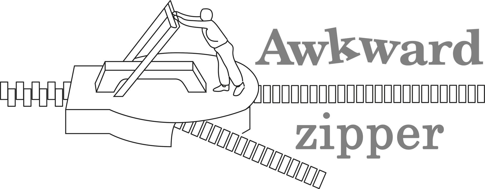

# Awkward-Zipper

Most of this code has been originally been written by the [coffea](https://github.com/scikit-hep/coffea/tree/master) developers.

## Developing

For installation using [`uv`](https://github.com/astral-sh/uv):

```bash
git clone https://github.com/maxymnaumchyk/awkward-zipper.git
cd awkward-zipper

uv venv
source .venv/bin/activate
uv pip install -e . --group dev
```

Now you can run the test with:
```bash
pytest tests/
```
